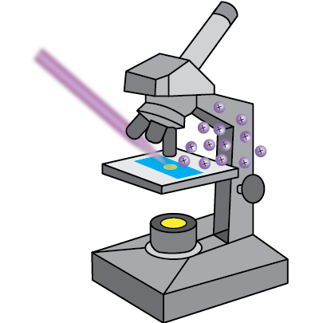

# microMS 
> Simplifying single cell analysis with feature-rich image processing

GUI for performing automatic cell finding and point based registration from whole-slide images.

## Install
microMS is a Python script written for [python 3](https://www.python.org/) >= 3.4.  After downloading all packages, no installation is required.

In addition to base components the following packages are required:
- [PyQt5](https://www.riverbankcomputing.com/software/pyqt/download5)
- [NumPy](http://www.numpy.org/)
- [SciPy](https://www.scipy.org/)
- [matplotlib](http://matplotlib.org/)
- [skimage](http://scikit-image.org/docs/dev/api/skimage.html)
- [openslide](http://openslide.org/) and [openslide-python](https://github.com/openslide/openslide-python#installation)
- [pyserial](https://pypi.python.org/pypi/pyserial)

##Launching
The main GUI is started by running the main script, microMS.py:
```
python microMS.py
```
On Windows, microMS.bat can launch the GUI as well.

##Usage
See the [user guide](UserGuideD2.pdf) for full documentation.

##About
The main GUI class is composed of widgets in the GUICanvas package for displaying a microscope image and population level statistics as a histogram.  Each widget interacts with microMSModel object, representing a microscopy experiment, a mass spectrometer system, and their interacting data.  

A slideWrapper provides an object for interacting with a set of microscopy images representing brightfield and different fluorescence channel images.  The current field of view is maintained to simplify controller interaction with the image. The ImageUtilities package also contains modules for cell finding, patterning target positions, and optimizing travel paths.

coordinateMappers are implementations of an abstract base class providing an interface to the GUI software. At a minimum, the mapper aligns pixel positions with physical coordinates and provides a means to translate target positions on an image to instrument-specific directions. Currently, four concrete implementations are included to demonstrate the versitility of the software. Coordinate systems for a Bruker UltrafleXtreme, a Bruker SolariX, an AB Sciex oMALDI sample stage and a lab-built 3-axis liquid microjunction probe are contained in the CoordianteMappers package.

## License

MIT © [Troy Comi](https://github.com/troycomi)
